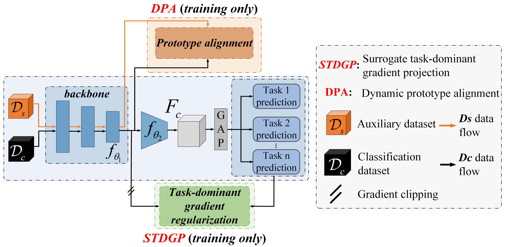

# IGReg: Mitigating Gradient Conflicts for Multi-Task Glioma Phenotyping and Grading via Implicit Regularization



This repository provides the **PyTorch implementation** of our paper published in **Pattern Recognition**:

> Qijian Chen, Lihui Wang, Zeyu Deng, Rongpin Wang, Li Wang, Yi Chen, Yue-Min Zhu, and Hongjiang Wei.  
> **Mitigating gradient conflicts for multi-task glioma phenotyping and grading via implicit regularization**.  
> *Pattern Recognition*, 2026, Article 113974.  
> DOI: [10.1016/j.patcog.2026.113974](https://doi.org/10.1016/j.patcog.2026.113974)

## Method Overview

IGReg is designed to mitigate optimization conflicts in multi-task glioma phenotyping and grading. It integrates two plug-and-play modules into a standard multi-task learning (MTL) framework.

### 1. Dynamic Prototype Alignment (DPA)

- Constructs a semantic prototype space using an **auxiliary segmentation dataset** that is different from the glioma multi-task classification dataset.
- Aligns task-specific features from the MTL framework with relevant prototypes via contrastive learning.
- Enhances feature consistency and reduces task-specific gradient noise.

### 2. Surrogate Task-Dominant Gradient Projection (STDGP)

- Preserves the dominant gradient direction of the current task by orthogonally projecting gradients from other tasks.
- Helps maintain discriminative task-specific representations during multi-task optimization.
- Introduces a conditional regularization loss to enforce consistency between high-confidence surrogate-derived features and primary classification features.

## Backbone Network

The backbone of IGReg is adapted from the [MA-MTLN](https://github.com/infinite-tao/MA-MTLN) architecture proposed in:

> Zhang, Yongtao, Li, Haimei, Du, Jie, Qin, Jing, Wang, Tianfu, Chen, Yue, Liu, Bing, Gao, Wenwen, Ma, Guolin, & Lei, Baiying. (2021). 3D multi-attention guided multi-task learning network for automatic gastric tumor segmentation and lymph node classification. *IEEE Transactions on Medical Imaging*, 40(6), 1618–1631.

## Data & Preprocessing

IGReg was evaluated using multi-center glioma MRI datasets. In the released implementation and experiments, **only T1CE and T2W modalities were used**.

The dataset usage in this paper is organized as follows. The three classification datasets, including MI-20, EGD, and LGG-1p/19q, were pooled and randomly split at the case level into **80% training** and **20% validation**. MI-21 was used only for prototype alignment in the DPA module. Before prototype alignment, the MI-21 cases overlapping with the classification-labeled subset of MI-20 were excluded because these cases had already been used for model training; cases overlapping with UCSF-PDGM were also excluded to avoid data leakage into the external test set. UCSF-PDGM, REMBRANDT, and GZPH were used as independent multi-center test sets.

| Dataset | No. of cases | Role in this paper | Split / usage | Modalities used | Main available annotations |
|---|---:|---|---|---|---|
| MI-20 | 660 | Multi-task classification training/validation | Included in the pooled 80%/20% training-validation split | T1CE, T2W | IDH, 1p/19q, LHG labels; WT/TC/ET masks |
| EGD | 774 | Multi-task classification training/validation | Included in the pooled 80%/20% training-validation split | T1CE, T2W | IDH, 1p/19q, LHG labels; WT masks |
| LGG-1p/19q | 158 | Multi-task classification training/validation | Included in the pooled 80%/20% training-validation split | T1CE, T2W | 1p/19q and LHG labels; WT masks |
| MI-21 | 2,040 | Auxiliary data for prototype alignment | Used for DPA prototype construction/alignment after excluding cases overlapping with the classification-labeled MI-20 subset and UCSF-PDGM; not used for multi-task classification training | T1CE, T2W | WT/TC/ET masks |
| UCSF-PDGM | 501 | Independent multi-center testing | External test set | T1CE, T2W | IDH, 1p/19q, LHG labels; WT/TC/ET masks |
| REMBRANDT | 130 | Independent multi-center testing | External test set | T1CE, T2W | LHG labels available for part of the cohort |
| GZPH | 78 | Independent multi-center testing | External test set | T1CE, T2W | IDH and LHG labels |

The detailed task-label distribution is summarized below. Unknown labels were not used for the corresponding task-specific supervision or evaluation.

| Dataset | IDH wildtype | IDH mutated | IDH unknown | 1p/19q co-deleted | 1p/19q intact | 1p/19q unknown | LGG | HGG | LHG unknown |
|---|---:|---:|---:|---:|---:|---:|---:|---:|---:|
| MI-20 | 108 | 86 | 466 | 26 | 165 | 469 | 103 | 293 | 264 |
| MI-21 | 0 | 0 | 2,040 | 0 | 0 | 2,040 | 0 | 0 | 2,040 |
| EGD | 312 | 155 | 307 | 73 | 186 | 515 | 214 | 502 | 58 |
| LGG-1p/19q | 0 | 0 | 158 | 102 | 56 | 0 | 158 | 0 | 0 |
| UCSF-PDGM | 397 | 104 | 0 | 15 | 395 | 91 | 99 | 401 | 1* |
| REMBRANDT | 0 | 0 | 130 | 0 | 0 | 130 | 69 | 43 | 18 |
| GZPH | 21 | 38 | 19 | 0 | 0 | 78 | 41 | 37 | 0 |

\* For UCSF-PDGM, the LHG-unknown count is kept consistent with the total number of cases in this README table.

Data acquisition, preprocessing, and base model construction follow our previously released code:
[CMTLNet Repository](https://github.com/ChiChienMile/CMTLNet/). Public datasets can be obtained through their original sources, and the corresponding preprocessing scripts are provided in the released repository. The private GZPH cohort cannot be publicly redistributed due to institutional restrictions.

## Dependencies

The released code uses the **Adam optimizer by default**, which is available in standard PyTorch and does not require additional installation.

However, we recommend using the **Lion optimizer** when possible, as it usually provides better prediction performance in our experiments. To use Lion, please install:

```bash
pip install lion-pytorch
```

Lion optimizer repository: [lion-pytorch](https://github.com/lucidrains/lion-pytorch)

## Usage

### Full Training

Run the training script:

```bash
python Train_IGReg.py
```

> **Note**: The data loader needs to be configured before training. Please refer to [CMTLNet](https://github.com/ChiChienMile/CMTLNet/) for the basic code structure and preprocessing pipeline.

### Important Settings

By default, IGReg uses:

```python
optimizer = "adam"
num_channels = 24
```

The default setting `num_channels=24` is more memory-efficient and suitable for most GPUs. If sufficient GPU memory is available, we recommend using:

```python
num_channels = 32
```

In our experiments, `num_channels=32` usually provides better prediction performance.

Although Adam is used as the default optimizer for better compatibility, we recommend using Lion for improved performance when the required package is available:

```python
optimizer = "lion"
```

Please note that the released code is configured for a three-task training setting, with a default batch size of 2 for each task. When using different task inputs or batch-size settings, the training process of `G1`, `G2`, and `G3` needs to be adjusted accordingly.

### Quick Model I/O Demo

Run the demo script to quickly test model input/output:

```bash
python model.IGReg.py
```

## Citation

If you find this repository useful, please consider citing our IGReg paper:

```bibtex
@article{CHEN2026113974,
  title = {Mitigating gradient conflicts for multi-task glioma phenotyping and grading via implicit regularization},
  journal = {Pattern Recognition},
  pages = {113974},
  year = {2026},
  issn = {0031-3203},
  doi = {https://doi.org/10.1016/j.patcog.2026.113974},
  url = {https://www.sciencedirect.com/science/article/pii/S0031320326009398},
  author = {Qijian Chen and Lihui Wang and Zeyu Deng and Rongpin Wang and Li Wang and Yi Chen and Yue-Min Zhu and Hongjiang Wei}
}
```

If you use the preprocessing pipeline or base code from CMTLNet, please also cite:

```bibtex
@article{chen2025103435,
  title = {Cooperative multi-task learning and interpretable image biomarkers for glioma grading and molecular subtyping},
  journal = {Medical Image Analysis},
  pages = {103435},
  year = {2025},
  issn = {1361-8415},
  doi = {https://doi.org/10.1016/j.media.2024.103435},
  url = {https://www.sciencedirect.com/science/article/pii/S1361841524003608},
  author = {Qijian Chen and Lihui Wang and Zeyu Deng and Rongpin Wang and Li Wang and Caiqing Jian and Yue-Min Zhu}
}
```

Please also cite the backbone network source:

```bibtex
@article{zhang20213d,
  title = {3D multi-attention guided multi-task learning network for automatic gastric tumor segmentation and lymph node classification},
  author = {Zhang, Yongtao and Li, Haimei and Du, Jie and Qin, Jing and Wang, Tianfu and Chen, Yue and Liu, Bing and Gao, Wenwen and Ma, Guolin and Lei, Baiying},
  journal = {IEEE Transactions on Medical Imaging},
  volume = {40},
  number = {6},
  pages = {1618--1631},
  year = {2021},
  publisher = {IEEE}
}
```
